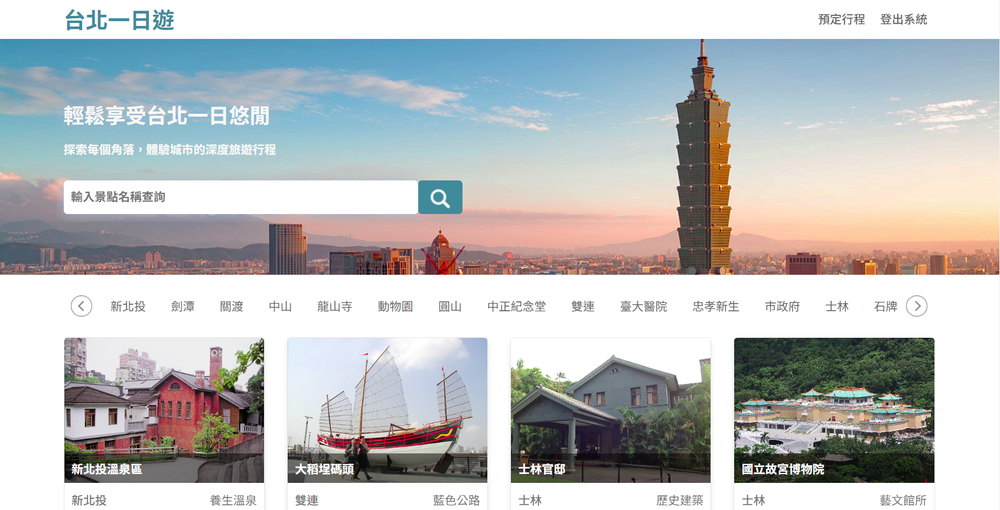
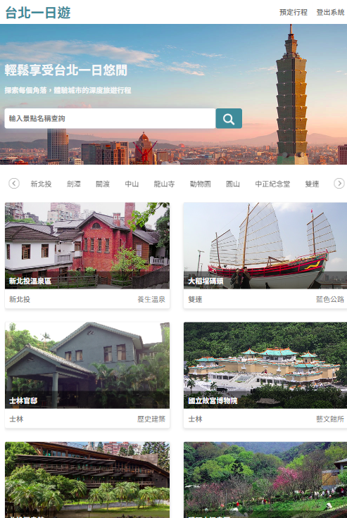
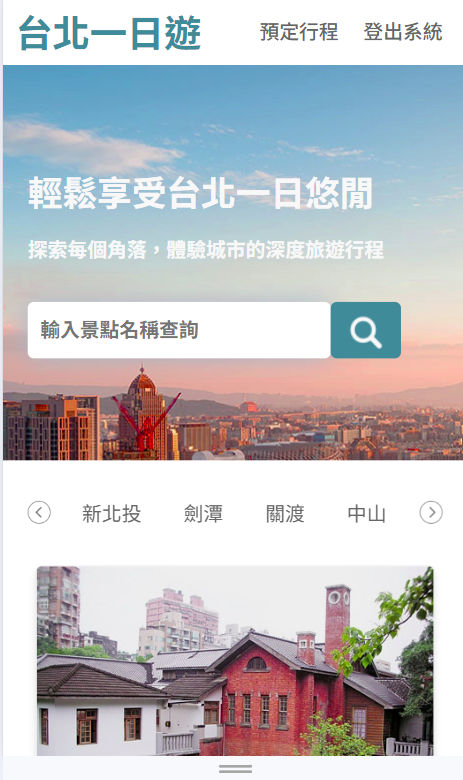
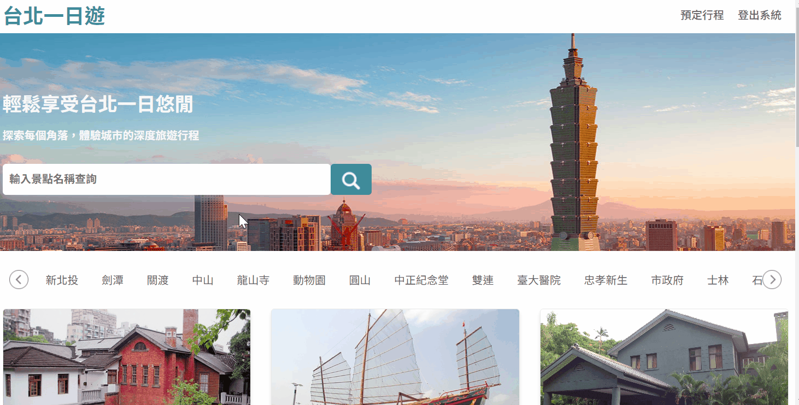
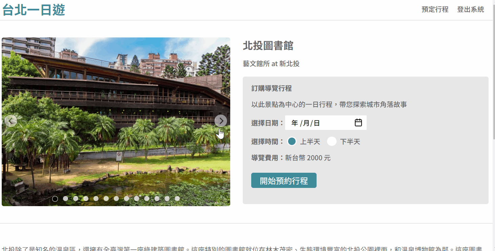

# 臺北一日遊

### 網站簡介

以臺北景點的單日行程為商品的電商網站，提供使用者搜尋景點、瀏覽景點、預約行程、付款等功能。

### 使用技術
- 使用語言

    - HTML
    - CSS
    - JavaScript
    - Python
    - FastAPI

- 資料儲存
    - MySQL

- 網站部署
    - AWS EC2

- 金流處理
    - TapPay

### RWD：針對電腦、平板、手機進行響應式設計

### (1) 首頁：無限捲軸，初始加載 12 個景點，其餘在捲軸到底時會再加載 12 個，直到結束

### (2) 捷運站捲軸：點擊左右方向鍵，可左右捲動捷運站列表

### (3) 景點關鍵字搜尋：搜尋捷運站關鍵字（如：劍潭）或景點關鍵字（如：溫泉），能透過關鍵字比對找到相關景點

### (4) 景點頁：點擊照片左右鍵可切換景點照片，搭配下方照片圓點，能看出該景點共有幾張照片

### (5) 預約行程與付款：選擇日期、上半天/下半天，點擊預約行程後，可輸入測試卡號完成付款流程。

- 測試卡號：4242 4242 4242 4242
- 有效日期：未來任一月/年
- CCV：123

